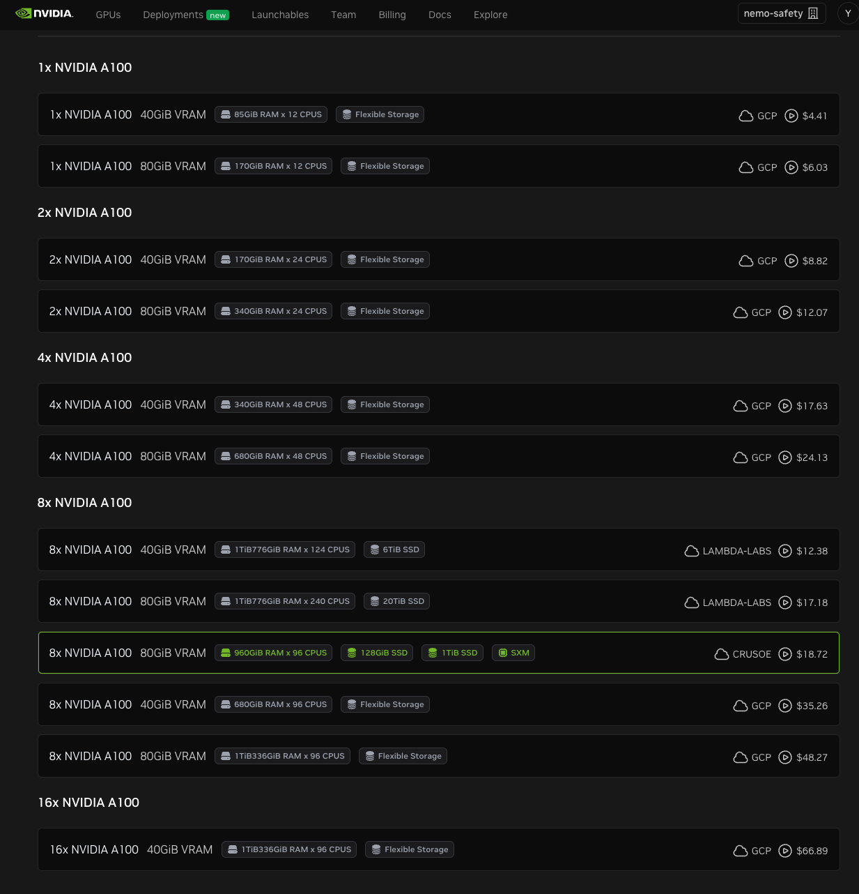
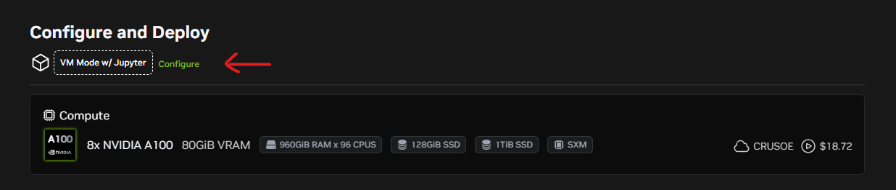
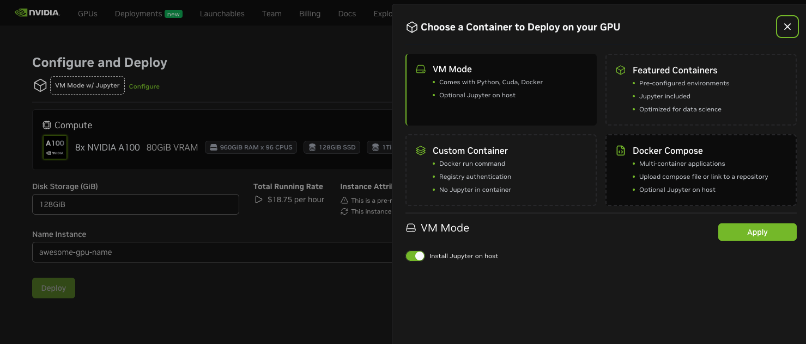
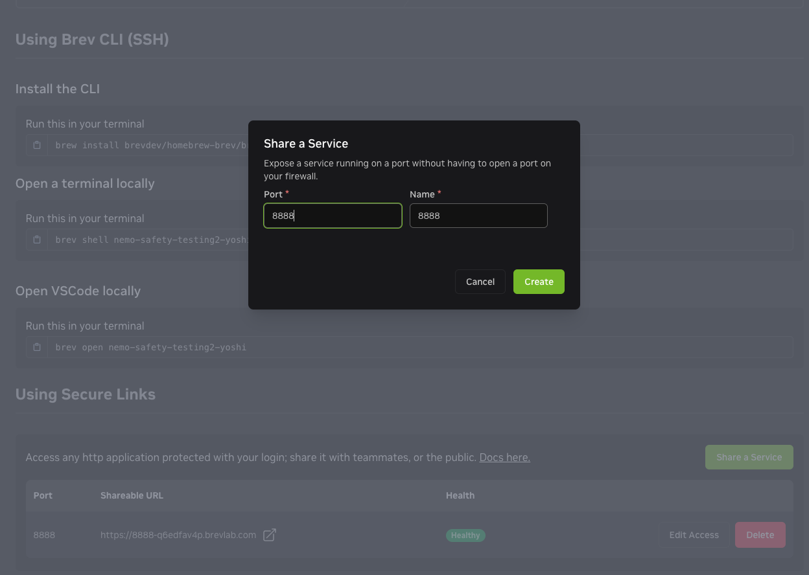
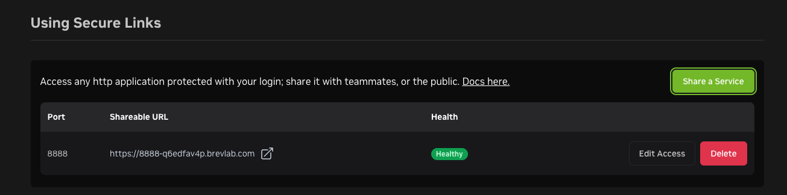

# Safety for Agentic AI: Developer Blueprint Notebooks

This directory has four notebooks to walk you through the core features of adding safety to an open model:

- [Set up the environment by configuring and installing required packages](./Step0_Setup.ipynb)
- [Evaluate the base model for safety and accuracy using NeMo Eval](./Step1_Evaluation.ipynb)
- [Post-train the base model to add content safety and preserve accuracy](./Step2_Safety_Post_Training.ipynb)
- [Rerun the same safety and accuracy evaluation and view the model safety report card to see how the model has improved](./Step3_Post_Training_Eval.ipynb)

These notebooks were developed using 8 x H100 80GB GPUs.
You must use the same or similar computational resources and follow the notebooks in sequential order (Step0->Step1->Step2->Step3).

You can use [NVIDIA Brev](https://developer.nvidia.com/brev) to launch an 8 x H100 instance.

You will need to generate the following API keys:

- `NVIDIA_API_KEY` from [build.nvidia.com](https://build.nvidia.com/)
- `HF_TOKEN` from [HF Hub](https://huggingface.co/models)

For post-training, you can optionally use [Weights & Biases](https://wandb.ai/home) for experiment tracking.

## Set Up Using Brev

### Download and Edit Docker Compose File

1. Download the <https://raw.githubusercontent.com/NVIDIA-AI-Blueprints/safety-for-agentic-ai/refs/heads/main/deploy/docker-compose.yaml> file.

1. Edit the `docker-compose.yaml` file.

   - Add your NGC API key

     ```yaml
      ...
      environment:
         - API_KEY="<ngc-api-key>"
      ```

   - If you use an instance that is not a CRUSOE instance, such as GCP, comment out the `volumes` section:

     ```yaml
     #    volumes:
     #      - /ephemeral:/ephemeral
     ```

### Create and Start Instance

1. Go to <https://brev.nvidia.com/>.

1. Create **New Instance**.

1. Choose 8 x H100 or A100 80GB on CRUSOE or other providers.

   

1. Click **Configure**.

   

1. Click **Docker Compose**.

1. Upload the `docker-compose.yaml` that you updated with your NGC API key.

1. Click **Add Registry** and specify the following values:

   - Registry URL: `nvcr.io`
   - Username: `$oauthtoken`
   - Password: `<ngc-api-key>`

   

1. Click **Validate**.

1. Click **Deploy**.

Starting an instance requires approximately 15 to 20 minutes.

### Post-Launch Configuration

1. Access your instance page.

1. Click **Share a Service** and add port `8888`.

   

   Repeat this step and add port `8501` to access the report card that is part of the fourth notebook.
   The report card shows the improved evaluation scores after post-training the model.

1. Click the shareable URL for port `8888` to access JupyterLab.

   

1. Download the GitHub repository as a ZIP file:

   <https://github.com/NVIDIA-AI-Blueprints/safety-for-agentic-ai/archive/refs/heads/main.zip>

1. Upload the ZIP file to JupyterLab.

1. Click **Terminal** on the **Launcher** page and then unzip the archive.

   ```shell
   $ unzip safety-for-agentic-ai-main.zip
   ```

   The notebooks are located in the `safety-for-agentic-ai/notebooks` directory.
   Continue the set up by running the `Step0_Setup.ipynb` notebook.